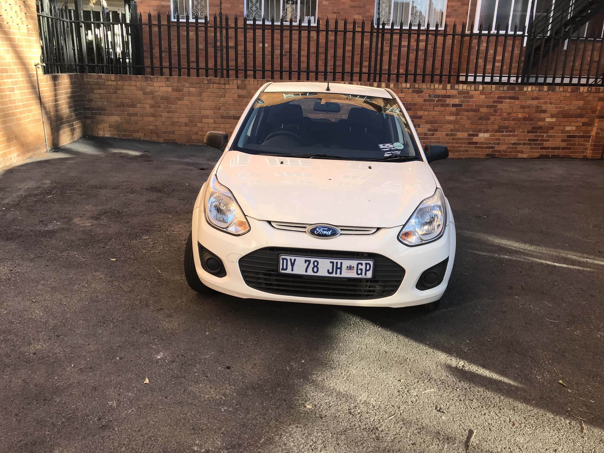
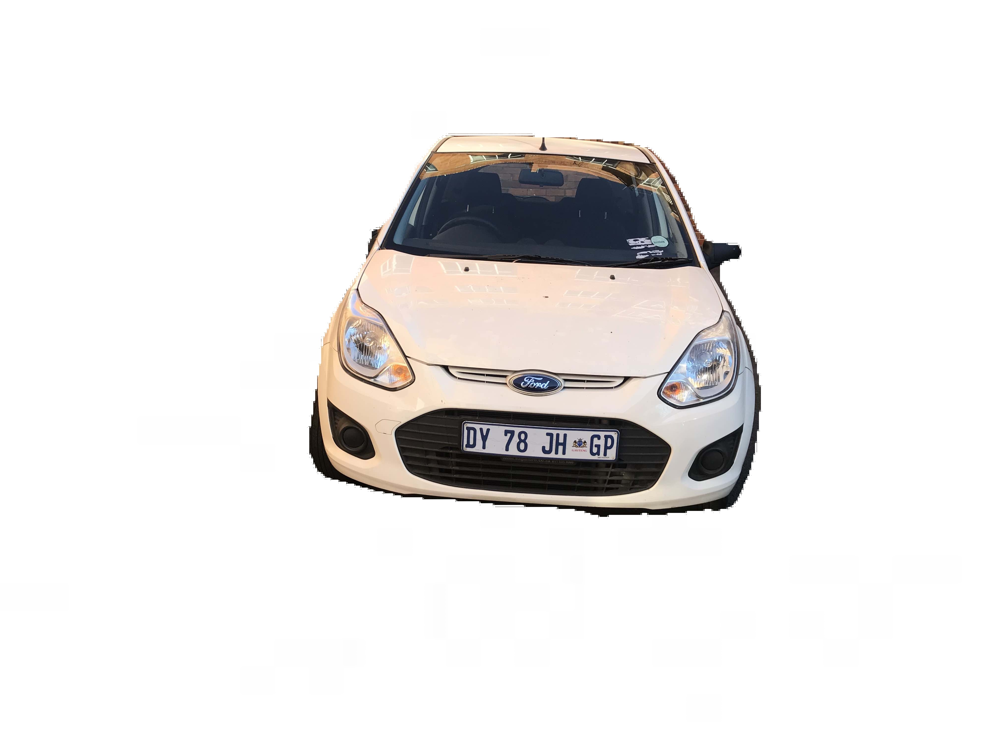
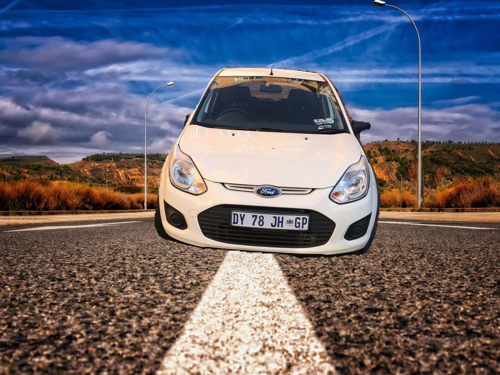

# CARscan-

## Approach 1 - 

Segmentation of images by detecting contours. It failed because in images with elements along with cars were also getting detected , and were difficult to separate because few of them were having greater area.

## Approach 2 -

Detection of Cars and using bounding box to create mask layer and segment them to separate from the background. However bounding boxes are not accurate and can be bigger or smaller than the actual car. Thus this failed. 

## Approach 3 -

Semantic Segmentation of images using PixelLib with help of Pascalvoc dataset trained with Deeplabv3+ framework. With just a few lines of code , a tiresome job is done with the help of PixelLib library. 

### Input (provided)



### Output (No background)



### Output (New background)




### Dependencies :

tensorflow : 2.0 or higher
```
$ pip install tensorflow
```
scikit-image :
```
$ pip install scikit-image
```
PIL:
```
$ pip install pillow
```
PixelLib:
```
$ pip install pixellib
```

### How to start :

* Clone the repo
```
git clone https://github.com/BlueBlaze6335/CARscan-.git
```
* Create venv
```
python -m venv env
```
* Download dependencies
* Run python file
```
python carscan.py
```


